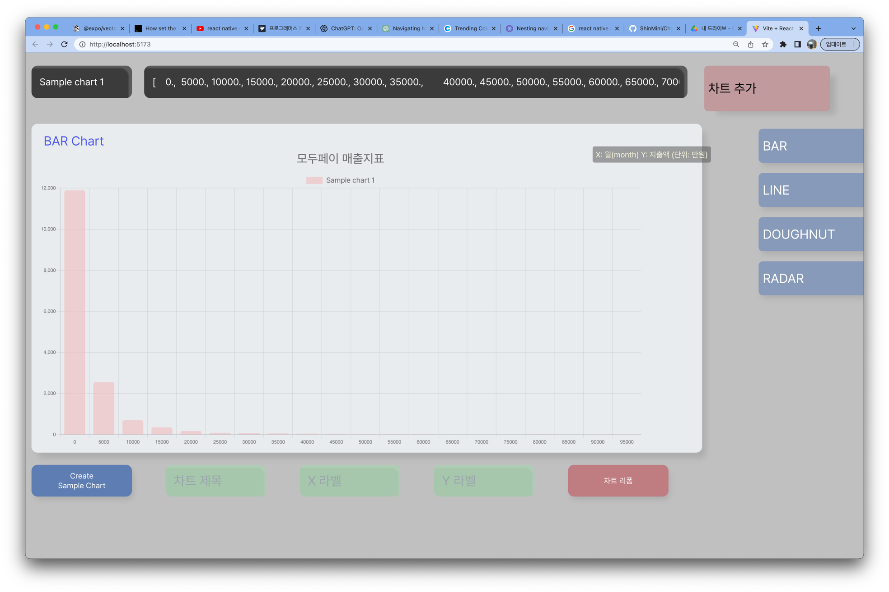
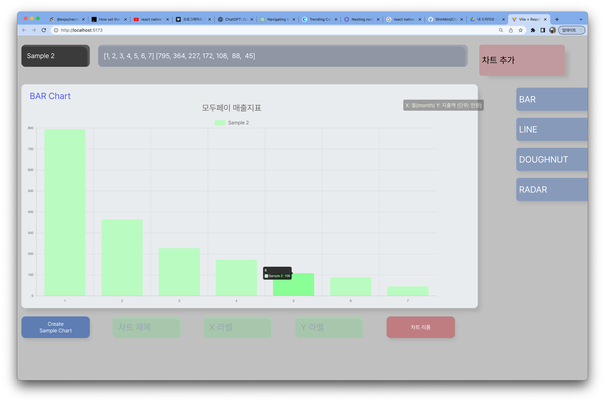
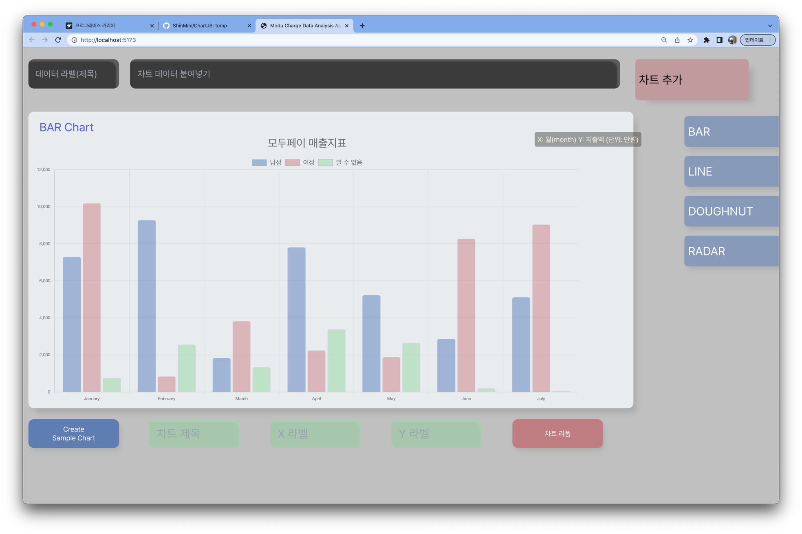
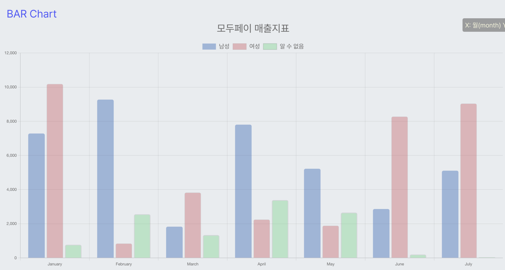
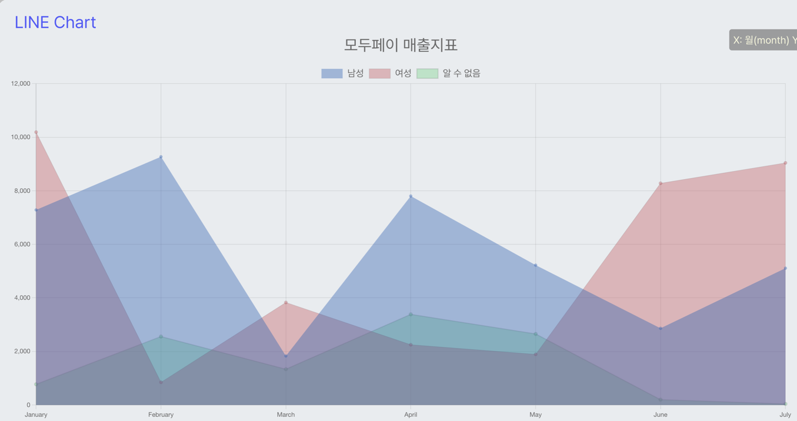
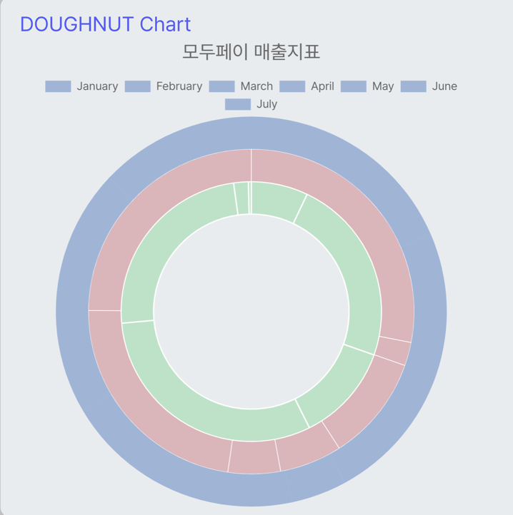
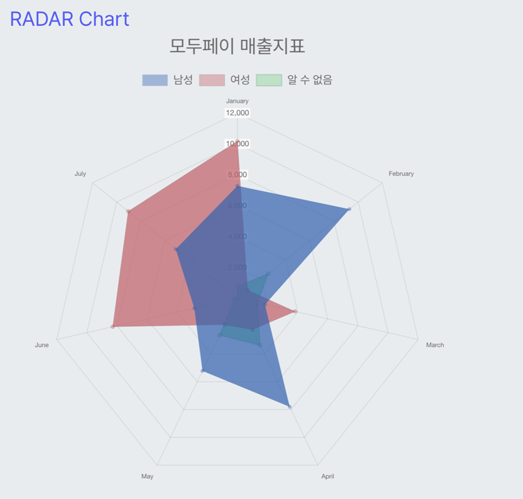
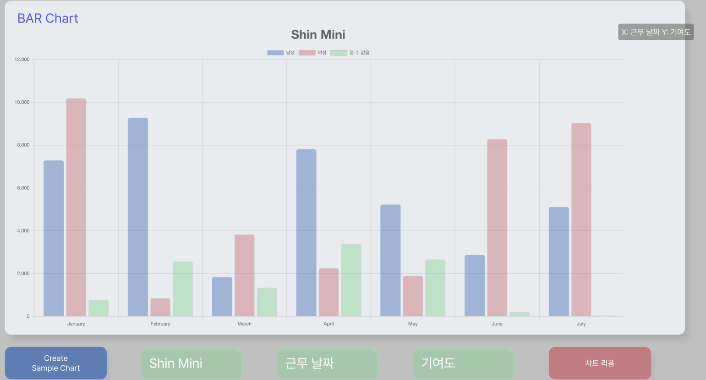

# Chart js, About Data Analysis Web App

* [English](#english)
* [한국어](#한국어)

---

### English

---

## Table of Contents

#### 1 - [Getting Started](#getting-started)
#### 2 - [Usage](#how-to-usages-a-chartjs-web-app)
#### 3 - [Contributing](./docs/CONTRIBUTING.md)
#### 4 - [License](#license)
#### 5 - [Author](#author)

# Getting Started

## Prerequisites

### [Node.js](https://nodejs.org/en/)

- need to install node.js file
* if you don't have node.js file, you can download node.js file from [here](https://nodejs.org/en/)
* if you have node.js file, you can check your node.js version by using command line
	* `node -v`
	* `npm -v`

### [yarn](https://yarnpkg.com/)

- need to install yarn file
* if you don't have yarn file, you can download yarn file from [here](https://yarnpkg.com/)
* if you have yarn file, you can check your yarn version by using command line
	* `yarn -v`

### [React.js](https://reactjs.org/)

- this web is based on React.js

### [Chart.js](https://www.chartjs.org/)

- this web is based on Chart.js library for make a chart

### [Typescript](https://www.typescriptlang.org/)

- this web is based on Typescript

## Installing

### 1. Clone this repository

``` bash
# bash or zsh
	git clone https://github.com/ShinMini/ChartJS.git
```

### 2. Install the Node.js

### in mac os

``` bash
# bash or zsh
	brew install node
```

### in windows os
``` shell
# powershell
	choco install nodejs
```

* or

``` shell
# powershell
	winget install -e --id OpenJS.NodeJS
```

### 3. Install the Yarn
```bash
# bash or zsh
	npm install -g yarn
```

### 4. move to the project directory

```bash
# bash or zsh
	cd ChartJS
```

### 5. Install the project's needed dependencies with yarn

```bash
# bash or zsh
	yarn install
```

### 6. Run the project!

```bash
# bash or zsh
	yarn dev
```


## How to Usages a Chart.js web app?

#### 1. Create a Chart
#### 2. Reform a Chart


---

## Create A Chart !

## Sample 1

``` typescript
    /** Y Axios Array -> represent : vertical axis data
			아래 데이터는 y축을담당합니다,
			the data type is number | string
			the data length is limited by X Axio array length
    */
    [    0.,  5000., 10000., 15000., 20000., 25000., 30000., 35000.,
           40000., 45000., 50000., 55000., 60000., 65000., 70000., 75000.,
           80000., 85000., 90000., 95000.]

    /** X Axios Array -> represent : horizontal axis data
			아래 데이터는 x축을 담당합니다.
			the data type is number
    */
    [1.189e+04, 2.553e+03, 6.970e+02, 3.490e+02, 1.700e+02, 8.800e+01,
    6.400e+01, 5.400e+01, 4.500e+01, 3.900e+01, 3.100e+01, 2.800e+01,
    1.800e+01, 1.100e+01, 1.000e+01, 9.000e+00, 2.000e+01, 1.100e+01,
    6.000e+00, 6.000e+00]
```

### Result



## Sample 2

``` typescript
	/** Y Axios Array value data sets */
	[1, 2, 3, 4, 5, 6, 7]

	/** X Axios Array value data sets */
	[795, 364, 227, 172, 108,  88,  45]
```

### Result



## Sample 3

### when you clicked the bottom left blue botton,  => create random chart data



## Options

### you can even change the chart types by using the right blue button.

## Chart Type

### Bar Chart(default)



### Line Chart



### Doughnut Chart



### Radar Chart



## also you can reform the subtitle of chart by using the bottom green button.



---

## this App is based on React.js, Chart.js, Typescript

## License

* MIT License (MIT)

## Author

- [ShinMini](https://github.com/ShinMini/ChartJS)

[Up To Top](#english)

----------------

### 한국어

--------------

## 목차

### - [시작하기](#필요사항)
### - [사용법](#차트생성하기)
### - [Contributing](./docs/CONTRIBUTING.md)
### - [License](#license)
### - [Author](#author)

---

## 필요사항

### [Node.js](https://nodejs.org/en/)

- Node js 설치가 필요한 경우
* node js 공식문서 [here](https://nodejs.org/en/)
* node js 설치를 완료한 경우, 설치가 제대로 되었는지 터미널을 열어 해당 명령어를 입력해 확인
	* `node -v`
	* `npm -v`

### [yarn](https://yarnpkg.com/)

- 프로젝트 빌드에 필요한 yarn 설치가 필요한 경우,
* yarn 공식문서 [here](https://yarnpkg.com/)
* yarn 설치를 완료한 경우, 설치가 제대로 되었는지 터미널을 열어 해당 명령어를 입력해 확인
	* `yarn -v`

### [React.js](https://reactjs.org/)

- 해당 웹 앱은 React.js를 기반으로 생성되었습니다.

### [Chart.js](https://www.chartjs.org/)

- 해당 웹 앱은 차트를 생성하기 위해, Chart.js 라이브러리를 사용했습니다.

### [Typescript](https://www.typescriptlang.org/)

 - 해당 웹 앱은 타입스크립트를 사용해 빌드했습니다.

## 앱 설치

### 1. 깃 저장소에서 필요한 파일 설치

``` bash
# bash or zsh
	cd ~
	git clone https://github.com/ShinMini/ChartJS.git
```

### 2. Node.js 설치

#### mac os 사용자의 경우, 아래 커맨드를 통해 node.js 설치

``` bash
# bash or zsh
	brew install node
```

#### windows 사용자의 경우, 아래 커맨드 입력

``` shell
# powershell
	choco install nodejs
```

* or

``` shell
# powershell
	winget install -e --id OpenJS.NodeJS
```

### 3. Yarn 설치

```bash
# bash or zsh
	npm install -g yarn
```

### 4. 프로젝트 실행을 위해, 터미널 현재 위치를 해당 프로젝트 폴더로 이동

```bash
# bash or zsh
	cd ~/ChartJS
```

### 5. 프로젝트 빌드에 필요한 라이브러리를 yarn을 사용해 설치

```bash
# bash or zsh
	yarn install
```

### 6. 프로젝트 실행!

```bash
# bash or zsh
	yarn dev
```


## Chart.js web app 사용 방법

#### 1. 차트 생성
#### 2. 차트 리폼


---

## 차트생성하기

## 예시 1

``` typescript
/**
* Y 축 배열 -> 세로축 데이터를 나타냅니다.
* 배열 내 데이터 타입은 string(문자열) 또는 number(숫자) 타입이 가능합니다.
* Y 축 배열 길이는 X 축 배열 길이와 동일하거나 많아야 합니다.
*/

    [    0.,  5000., 10000., 15000., 20000., 25000., 30000., 35000.,
           40000., 45000., 50000., 55000., 60000., 65000., 70000., 75000.,
           80000., 85000., 90000., 95000.]

/** X 축 배열 -> 가로축 데이터를 담당합니다.
* 배열 내 데이터 타입은 number(숫자) 타입만 사용 가능합니다.
*/
    [1.189e+04, 2.553e+03, 6.970e+02, 3.490e+02, 1.700e+02, 8.800e+01,
    6.400e+01, 5.400e+01, 4.500e+01, 3.900e+01, 3.100e+01, 2.800e+01,
    1.800e+01, 1.100e+01, 1.000e+01, 9.000e+00, 2.000e+01, 1.100e+01,
    6.000e+00, 6.000e+00]

```

## 결과


## Sample 2

``` typescript
	/** Y Axios Array value data sets */
	[1, 2, 3, 4, 5, 6, 7]

	/** X Axios Array value data sets */
	[795, 364, 227, 172, 108,  88,  45]
```

##  결과


## Sample 3

### 왼쪽 하단에 있는 파란 버튼 클릭시 랜덤 차트 데이터 생성


## Options

### 오른쪽 파란 버튼을 눌러, 화면에 표시되는 차트를 변경할 수 있습니다.

## Chart Type

### 바 Chart(default)


### 라인 Chart


### 도넛 Chart


### 레이더 Chart


### 또한 아래쪽 녹색 버튼을 사용하여 차트 부제목을 수정할 수 있습니다.


---

## 이 앱은 React.js, Chart.js, Typescript 를 기반으로 합니다.

## 라이선스

* MIT License (MIT)

## 작성자

- [ShinMini](https://github.com/ShinMini/ChartJS)
- 신현민입니다.

[Up To Top](#한국어)

---
